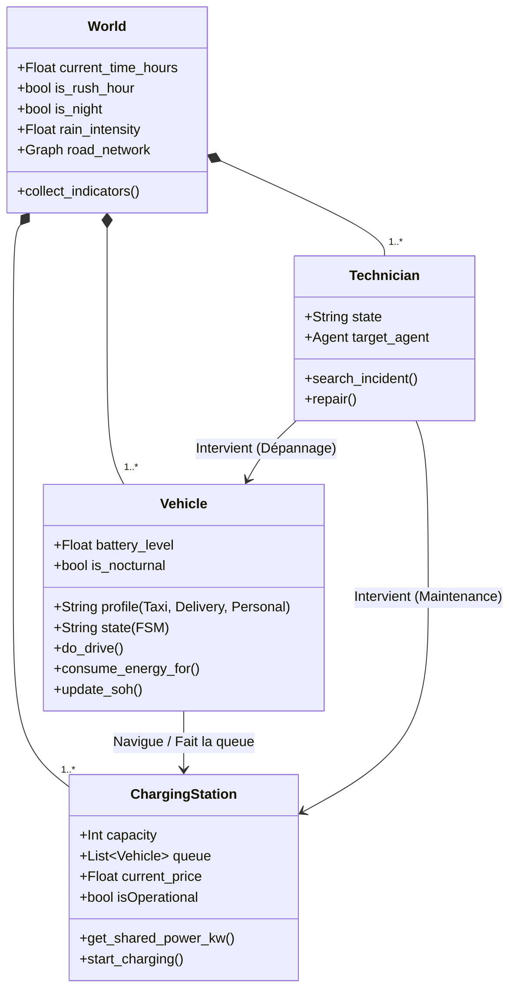
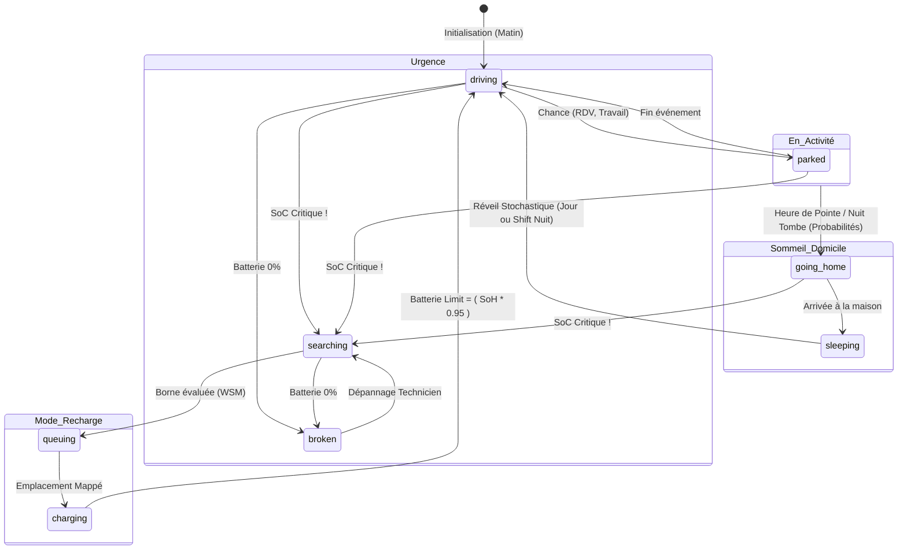

# Rapport Complet du Projet : Simulation Multi-Agents de Recharge EV (GAMA)

## 1. Vue d'Ensemble du Projet
Le projet est une simulation avancée de **Modélisation Multi-Agents (ModSim)** développée sur la plateforme **GAMA**. Son objectif est d'étudier et de reproduire avec un haut degré de réalisme le trafic, la consommation énergétique et les stratégies de recharge d'une flotte hétérogène de véhicules électriques (EV) au sein d'un environnement urbain réel (importé via un shapefile routier GIS).

> [!IMPORTANT]
> Le simulateur se distingue particulièrement par la combinaison d'une **modélisation physique stricte** (modèles de batterie CC-CV, dégradation SoH, consommation en kWh/km) et d'un **comportement social organique** (logique de trafic, rythmes de sommeil circadiens, et sensibilité aux prix).

---

## 2. Architecture du Système & Entités

L'environnement est géré par une architecture globale qui coordonne les agents, les facteurs environnementaux (météo, horloge externe), et la topographie (connexité du graphe urbain).

**Trois grandes espèces d'agents interagissent :**

1. 🚗 **Véhicules (`vehicle`)** : Mobiles, avec des caractéristiques d'énergie propres et dirigés par une machine à états finis (FSM).
2. ⚡ **Stations de Recharge (`charging_station`)** : Nœuds d'infrastructures limités en capacité, gérant une grille de puissance et une file d'attente (FIFO avec priorités).
3. 🔧 **Techniciens (`technician`)** : Unités de patrouille capables de détecter et de réparer les véhicules et les stations tombant en panne aléatoirement.

### 2.1 Schéma Structurel (Diagramme de Classes)

---

## 3. Dynamiques et Mécanismes Principaux

### 3.1. Prise de Décision Multicritères (WSM)
Quand un véhicule a besoin d'une recharge, il ne sélectionne pas aveuglément la station la plus proche. Le simulateur déclenche l'évaluation des stations en temps réel par méthode pondérée prenant en compte :
- **La Distance (Alpha)** : Poids pour le trajet.
- **La File d'Attente (Beta)** : Poids pour l'ennui et la perte de temps.
- **L'Argent (Gamma)** : Évaluation du *Dynamic Pricing* imposé par la station surchargée. Selon son "profil" (Livreur pressé vs Particulier économe), les poids diffèrent.

### 3.2. Modélisation de la Batterie (Réalisme industriel)
- **Consommation environnementale** : La Météo (pluie) augmente la consommation par km.
- **Courbe de Recharge (CC-CV)** : Mode "Courant Constant" rapide jusqu'à 80%, puis "Tension Constante" décroissante pour atteindre le 100%. L'énergie plafonne à la capacité du chargeur partagée dynamiquement.
- **SoH (State of Health)** : Chaque véhicule mémorise son kilométrage et subit une dégradation linéaire maximale plafonnée à 70% de vie utile.

### 3.3. Comportements Spatiaux & Algorithmes
La plateforme nettoie le `shapefile` (élimination des segments déconnectés) et crée une **plus grande composante connexe**. Tous les déplacements utilisent l'algorithme sous-jacent de **Dijkstra**. Une fonction anti-blocage (Stuck Tracker) garantit qu'un agent mis en échec se recentre sur le graphe.

---

## 4. Modèle Temporel Organique & Heures Périodiques

Le cœur social du simulateur est le découplage asynchrone entre la physique du simulateur (`step` en secondes) et l'horloge biologique (qui tourne en mode accéléré = `time_multiplier × 60`).

### 4.1. Automate à États Finis (FSM) Comportemental

> [!TIP]
> **Stochasticité du comportement**  
> Les véhicules ne décident jamais de rentrer faire un créneau brutalement tous à cause de la lecture de l'horloge globale. Le passage à la nuit ou aux heures de pointes induit uniquement l'augmentation d'une probabilité d'effectuer un changement d'état. 

### 4.2. Flux Typé (Les Profils)
- Les **Taxis (60%)** : Extrêmement actifs, 40% ont des shifts nocturnes paramétrés (`is_nocturnal=true`). Vidage rapide de la batterie en *Rush Hour* dû au chauffage et arrêts (facteur `x1.5`).
- Les **Livreurs (20%)** : Batteries immenses, lents. 20% seulement sillonnent la nuit.
- Les **Particuliers (20%)** : Conduite axée autour du domicile (`home_location`). Stationnement massif le jour (`parked`), avec vagues de trafic lors des *Rush Hours* pour le retour. 95% dorment de nuit.

---

## 5. Perspectives Finales

Le modèle a muté d'une abstraction standard vers un agent complexe.   
Pour une présentation ModSim ou rapport universitaire, les tableaux de bord et visualisations implémentées garantissent un grand potentiel analytique. Par exemple, observer la convergence du trafic aux heures de points (`17h-19h`) générant simultanément un assombrissement météorologique, des congestions, des tarifs qui s'envolent aux bornes et des essaims de techniciens. L'approche Grid Search (Expérimentation Bacth) sur ce modèle peut désormais fournir des métriques industrielles excellentes afin d'évaluer le dimensionnement minimum rentable d'une ville en matière d'infrastructure.
