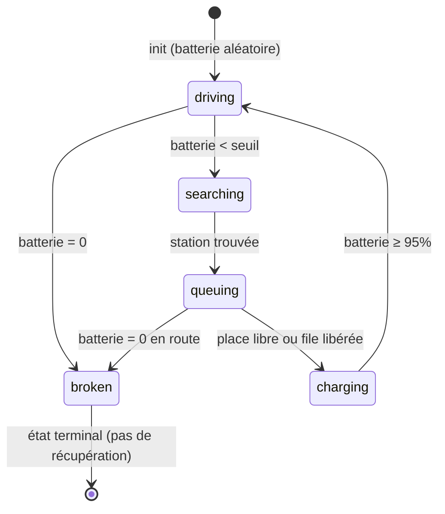

# Analyse & Améliorations — Simulation de Recharge EV (GAMA)

## Contexte

Analyse complète du modèle [ev_charging_simulation.gaml](file:///c:/Users/YVALTT/Gama_Workspace/ev_charging_simulation/models/ev_charging_simulation.gaml) pour résoudre les problèmes identifiés et proposer des améliorations significatives.

---

## 🔴 Problème 1 : Les véhicules se déchargent trop vite

### Diagnostic (Cause Racine)

Le problème se trouve dans l'action `consume_energy` (ligne 312-314) :

```gaml
action consume_energy {
    battery_level <- max(0.0, battery_level - consumption_rate * speed);
}
```

**Analyse mathématique :**
- `speed = vehicle_speed / 3.6 = 40 / 3.6 ≈ 11.11 m/cycle`
- `consumption_rate = 0.05`
- **Consommation par cycle** = `0.05 × 11.11 ≈ 0.556 % / cycle`
- Avec une batterie initiale de 100%, elle se vide en **~180 cycles**
- Si la batterie initiale est à 30% (minimum), elle atteint le seuil de 20% en **~18 cycles seulement !**

> [!CAUTION]
> La formule `consumption_rate * speed` crée une dépendance linéaire entre vitesse et consommation. Plus la vitesse est élevée, plus la décharge est brutale. Il n'y a aucune notion de **distance réelle parcourue** ni de **capacité batterie en kWh**.

### Solution Proposée : Modèle réaliste de consommation

Remplacer le modèle actuel par un modèle basé sur des données réelles de véhicules électriques :

```gaml
// Nouveaux paramètres (global)
float battery_capacity_kwh   <- 60.0;    // Capacité batterie typique (ex: Renault Zoe 52kWh, Tesla M3 60kWh)
float energy_consumption_kwh <- 0.18;    // kWh/km (moyenne VE : 0.15-0.22 kWh/km)
float charging_power_kw      <- 22.0;    // Puissance de recharge en kW (borne AC 22kW)

// Nouvelle action consume_energy
action consume_energy {
    float distance_km <- speed * step / 1000.0;  // distance en km parcourue ce cycle (step = durée d'un cycle en secondes)
    float energy_used_kwh <- energy_consumption_kwh * distance_km;
    float battery_drop <- (energy_used_kwh / battery_capacity_kwh) * 100.0;
    battery_level <- max(0.0, battery_level - battery_drop);
}
```

**Avec ce modèle :**
- Batterie 60 kWh, consommation 0.18 kWh/km
- Autonomie théorique = 60 / 0.18 ≈ **333 km** (réaliste !)
- Un véhicule roulant à 40 km/h mettra ~8.3h pour vider sa batterie

> [!IMPORTANT]
> Il faut aussi ajuster la variable `step` de GAMA pour que la granularité temporelle soit cohérente (ex: `step <- 10 #s;` pour un cycle = 10 secondes).

---

## 🔴 Problème 2 : Pas assez de stations de recharge

### Diagnostic

- `nb_stations = 10` pour `nb_vehicles = 50` → ratio **1 station pour 5 véhicules**
- `station_capacity = 4` → seulement **40 places de charge** pour 50 véhicules
- Les stations sont placées **aléatoirement** sur les routes : `location <- any_location_in(one_of(road));`
- Aucune logique de **couverture spatiale** → certaines zones peuvent être des "déserts de recharge"

### Solution Proposée

#### a) Augmenter les valeurs par défaut

```gaml
int   nb_stations      <- 15;    // Augmenté de 10 à 15
int   station_capacity <- 6;     // Augmenté de 4 à 6
```

#### b) Placement intelligent des stations (couverture spatiale)

Utiliser un algorithme de **dispersion maximale** (k-means simplifié) au lieu du placement aléatoire :

```gaml
// Dans le init{} - Placement par grille avec perturbation
create charging_station number: nb_stations {
    capacity <- station_capacity;
}

// Distribution spatiale après création
list<point> road_points <- road collect (each.shape.centroid);
int grid_side <- int(sqrt(float(nb_stations))) + 1;
float dx <- world.shape.width / grid_side;
float dy <- world.shape.height / grid_side;

int idx <- 0;
loop s over: list(charging_station) {
    int row <- int(idx / grid_side);
    int col <- idx mod grid_side;
    point grid_center <- {world.shape.location.x - world.shape.width/2 + (col + 0.5) * dx,
                          world.shape.location.y - world.shape.height/2 + (row + 0.5) * dy};
    // Trouver le point de route le plus proche du centre de grille
    point closest <- road_points with_min_of (each distance_to grid_center);
    s.location <- closest;
    idx <- idx + 1;
}
```

#### c) Ajouter un moniteur de couverture

```gaml
monitor "Couverture (m)" value: with_precision(
    mean(vehicle collect (min(charging_station collect (each distance_to myself)))), 0);
```

---

## 🔴 Problème 3 : Méthodologie de gestion du temps de vie batterie / km

### Diagnostic Actuel

Il n'existe **aucun lien explicite** entre la distance parcourue (`distance_traveled`) et la capacité de la batterie. Le modèle actuel est purement basé sur un taux arbitraire.

### Solution : Modèle de dégradation batterie

Introduire un facteur de **dégradation** (State of Health - SoH) qui réduit progressivement la capacité effective :

```gaml
// Nouveaux attributs du véhicule
float total_km_traveled <- 0.0;          // km parcourus au total
float battery_soh <- 100.0;              // State of Health (%)
float soh_degradation_per_1000km <- 0.5; // Perte de 0.5% de SoH tous les 1000 km

// Nouveau reflex de dégradation (appelé périodiquement)
reflex update_degradation when: every(100 #cycles) {
    float total_km <- distance_traveled / 1000.0;  // convertir m en km
    battery_soh <- max(70.0, 100.0 - (total_km / 1000.0) * soh_degradation_per_1000km);
}

// La recharge tient compte du SoH
reflex do_charge when: (state = "charging") {
    float effective_max <- battery_soh;  // La batterie ne peut plus atteindre 100%
    battery_level <- min(effective_max, battery_level + charging_rate);
    if (battery_level >= effective_max * 0.95) {
        ask target_station { do release_vehicle(myself); }
        target_station <- nil;
        state <- "driving";
    }
}
```

**Tableau de correspondance km / Santé batterie :**

| Distance totale (km) | SoH (%) | Autonomie effective (km) |
|----------------------|---------|--------------------------|
| 0                    | 100     | 333                      |
| 50 000               | 97.5    | 325                      |
| 100 000              | 95.0    | 317                      |
| 150 000              | 92.5    | 308                      |
| 200 000              | 90.0    | 300                      |

---

## 🟡 Problème 4 : Faire clignoter les véhicules en panne

### Solution : Utiliser le cycle GAMA pour alterner la visibilité

```gaml
// Dans l'aspect icon_aspect du vehicle (remplacer la partie "broken")
aspect icon_aspect {
    float icon_size <- 20.0;

    if (use_icons) {
        string img_path;
        if      (state = "driving")   { img_path <- "../images/car_blue.png"; }
        else if (state = "searching") { img_path <- "../images/car_orange.png"; }
        else if (state = "queuing")   { img_path <- "../images/car_orange.png"; }
        else if (state = "charging")  { img_path <- "../images/car_green.png"; }
        else {  // broken
            // CLIGNOTEMENT : alterner visible/invisible toutes les 5 cycles
            if ((cycle mod 10) < 5) {
                img_path <- "../images/car_red.png";
            } else {
                img_path <- nil;  // ne pas dessiner → effet clignotant
            }
        }

        if (img_path != nil) {
            draw image_file(img_path) size: {icon_size, icon_size};
        }
    } else {
        // Fallback formes géométriques
        rgb c;
        float alpha_val <- 255.0;
        if      (state = "driving")   { c <- #dodgerblue; }
        else if (state = "searching") { c <- #orange; }
        else if (state = "queuing")   { c <- #darkorange; }
        else if (state = "charging")  { c <- #limegreen; }
        else {
            c <- #red;
            // Effet clignotant en alternant l'opacité
            alpha_val <- ((cycle mod 10) < 5) ? 255.0 : 50.0;
        }
        draw circle(6) color: rgb(c.red, c.green, c.blue, int(alpha_val)) border: #black;
    }

    // ... (barre de batterie reste inchangée)
}
```

> [!NOTE]
> GAMA ne supporte pas nativement les animations fluides de clignotement. L'alternance par `cycle mod N` est la technique standard dans GAMA pour simuler un effet clignotant. On peut ajuster la fréquence en changeant la valeur du modulo.

---

## 🟡 Problème 5 : Identification des algorithmes utilisés

### Inventaire complet des algorithmes du modèle

| # | Étape / Composant | Algorithme | Description | Localisation |
|---|-------------------|------------|-------------|--------------|
| 1 | **Construction du graphe routier** | `as_edge_graph()` — Algorithme de construction de graphe topologique | Convertit les segments shapefile en un graphe orienté pondéré (poids = longueur). Utilise une structure de données adjacence. | Ligne 79 |
| 2 | **Routage / Déplacement** | `do goto` — Algorithme de **Dijkstra** (plus court chemin) | Le skill `moving` de GAMA utilise Dijkstra pour calculer le chemin le plus court sur le graphe routier entre la position actuelle et la destination. | Lignes 242, 279 |
| 3 | **Sélection de station** | **Scoring multi-critères pondéré** (Range Anxiety Score) | Algorithme heuristique de décision : `score = α × dist_normalisée + β × file_normalisée`. Les poids α et β s'adaptent dynamiquement au niveau de batterie (plus la batterie est faible, plus la distance pèse). C'est une variante de la **Somme Pondérée** (Weighted Sum Method - WSM) en analyse multicritère. | Lignes 325-349 |
| 4 | **Adaptation des poids (α, β)** | **Ratio dynamique linéaire** | `ratio = battery / threshold` → les poids se réajustent de manière linéaire en fonction de l'urgence (batterie basse → priorité distance). C'est une forme simplifiée de **logique floue** (fuzzy logic). | Lignes 329-331 |
| 5 | **Machine à états (FSM)** | **Automate à états finis déterministe** (DFA) | 5 états : `driving → searching → queuing → charging → driving` + `broken` (état puits). Transitions déterministes basées sur le niveau de batterie et la proximité des stations. | Lignes 228-307 |
| 6 | **Gestion des files d'attente** | **File FIFO** (First-In, First-Out) | Les véhicules attendant à une station sont servis dans l'ordre d'arrivée. Structure de données : `list<vehicle>` avec `first()` pour déqueue. | Lignes 132-153 |
| 7 | **Placement des stations** | **Placement aléatoire uniforme** | `any_location_in(one_of(road))` — distribution uniforme sur les segments routiers. **Pas d'optimisation spatiale.** | Ligne 84 |
| 8 | **Consommation d'énergie** | **Modèle linéaire** `ΔE = rate × speed` | Décroissance linéaire proportionnelle à la vitesse instantanée. **Pas de modèle physique** (pas de résistance aéro, pente, etc.). | Lignes 312-314 |
| 9 | **Recharge** | **Modèle linéaire constant** | `battery += charging_rate` chaque cycle jusqu'à 95%. **Pas de courbe de charge réaliste** (CC-CV). | Lignes 300-307 |
| 10 | **Exploration batch** | **Exploration exhaustive** (Grid Search) | Toutes les combinaisons de paramètres `among: [...]` sont testées avec 3 répétitions. | Lignes 501-519 |

### Diagramme FSM



---

## Propositions d'Améliorations Additionnelles

### A. Courbe de recharge réaliste (CC-CV)

Les batteries Li-ion ne chargent pas linéairement. La charge rapide ralentit après 80% :

```gaml
reflex do_charge when: (state = "charging") {
    float rate;
    if (battery_level < 80.0) {
        rate <- charging_rate;           // Charge rapide (Constant Current)
    } else {
        rate <- charging_rate * (1.0 - (battery_level - 80.0) / 20.0);  // Ralentissement (Constant Voltage)
    }
    battery_level <- min(100.0, battery_level + rate);
    // ...
}
```

### B. Récupération des véhicules en panne

Actuellement, `broken` est un **état terminal** — le véhicule ne sort jamais de la panne. Ajouter un service de dépannage :

```gaml
// Variable globale
int breakdown_recovery_time <- 50;  // cycles pour la récupération

// Attribut du véhicule
int breakdown_cycle <- 0;

// Nouveau reflex
reflex do_recovery when: (state = "broken") {
    if (breakdown_cycle = 0) { breakdown_cycle <- cycle; }
    if (cycle - breakdown_cycle >= breakdown_recovery_time) {
        battery_level <- 20.0;  // recharge de secours
        state <- "searching";
        breakdown_cycle <- 0;
    }
}
```

### C. Ajout d'un paramètre `step` pour le temps

```gaml
// Dans le global
float step <- 10 #s;  // chaque cycle = 10 secondes de temps simulé
```

---

## User Review Required

> [!IMPORTANT]
> **Priorisation** : Quelles améliorations souhaitez-vous que j'implémente en premier ? Je recommande cet ordre :
> 1. Corriger le modèle de consommation d'énergie (Problème 1) — **Impact critique**
> 2. Clignotement des véhicules en panne (Problème 4) — **Rapide à implémenter**
> 3. Augmentation et placement intelligent des stations (Problème 2)
> 4. Modèle de dégradation batterie / km (Problème 3)
> 5. Ajouts supplémentaires (courbe CC-CV, récupération panne)

> [!WARNING]
> Le modèle de consommation actuel est **fondamentalement cassé** car il ne tient pas compte des unités physiques réelles. La correction du Problème 1 changera radicalement le comportement de la simulation entière, il faut donc réajuster les autres paramètres en conséquence.

## Open Questions

1. **Quelle autonomie cible ?** Voulez-vous simuler un type de véhicule précis (ex: Renault Zoe 52kWh ≈ 300km, Tesla Model 3 60kWh ≈ 350km) ou rester générique ?
2. **Durée d'un cycle ?** Combien de temps réel un cycle GAMA doit-il représenter ? (suggestion : 10 secondes)
3. **Type de bornes ?** Borne lente AC (7kW, ~8h pour charge complète), AC rapide (22kW, ~2.5h), ou DC rapide (50kW, ~45min) ?
4. **Voulez-vous la récupération des véhicules en panne** (dépanneuse) ou doivent-ils rester définitivement en panne ?
5. **Faut-il implémenter toutes les améliorations** ou uniquement certaines d'entre elles ?

## Verification Plan

### Tests Automatisés (après implémentation)
- Vérifier que la batterie moyenne ne descend plus en dessous de 50% dans les 100 premiers cycles
- Vérifier que le nombre de pannes est significativement réduit vs. la version actuelle
- Vérifier le clignotement visuel des véhicules en panne dans le display OpenGL

### Validation par simulation
- Exécuter la simulation avec les paramètres par défaut pendant 5000 cycles
- Comparer les métriques (pannes, recharges, batterie moyenne) avant/après les modifications
- Utiliser le batch experiment pour valider la robustesse des nouveaux paramètres
